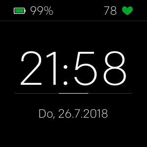
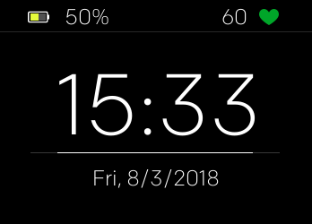
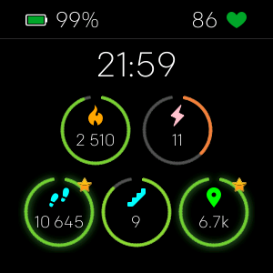
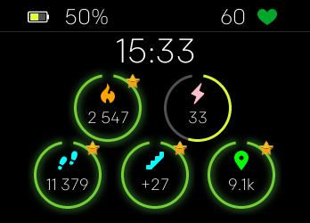
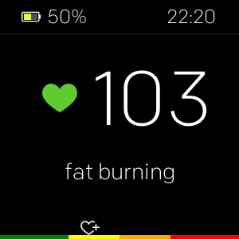
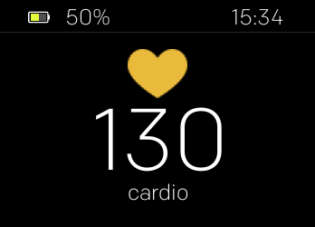

# DigiChron
**Clockface for Fitbit Versa**

## This clockface has two main views:

### 1. A simple and clean digital clock view showing
- the time in the middle (HH:MM)
- a slowly filling horizontal line denoting the seconds
- the date below
- a status bar on top:
  - LH corner: battery status
  - RH corner: heart rate
  
The time supports 24h and 12h format.
The day name supports DE (German) and EN (English) language. For all other, it defaults to english.
The date format supports US locale setting (M/D/YYYY), for all other locales, it defaults to D.M.YYYY

- **Versa**

- **Ionic**

### 2. The current stats
- the time smaller on the upper area (HH:MM)
- a status bar on top:
  - LH corner: battery status
  - RH corner: heart rate
- the following stats, all shown in slowly filling arcs from zero to the users goal
  - calories
  - active minutes
  - steps
  - floors
  - distance (in km)

If the goal is reached for a stat, a blur is surrounding the filled arc and a star is shown in the upper RH corner.

- **Versa**

- **Ionic**

### 3. A big heart rate display
- the time smaller in the RH upper corner of the status bar
- the heart rate big in the middle of the screen
- the current heart rate zone below

- **Versa**

- **Ionic**

## Usage

You can switch between both views with a tap on the display.
In the settings of the clock face, you can turn the third screen with the HR info on or off.

## Credits:

- The stars for completed goals are from [Freepik](https://www.freepik.com/free-vector/colorful-star-icons_787040.htm)

## Disclaimer:

The clockface was created as a hobby project.
I may or may not continue to work on it in the future.
Probably there will be some further version with some settings for color and with the support for more locales.

## Contact:

You can find the clockface sourcecode on [GitHub](https://github.com/tanstaaflFH/DigiChron)

You can contact me under [fh.development@zoho.eu](mailto://fh.development@zoho.eu)
